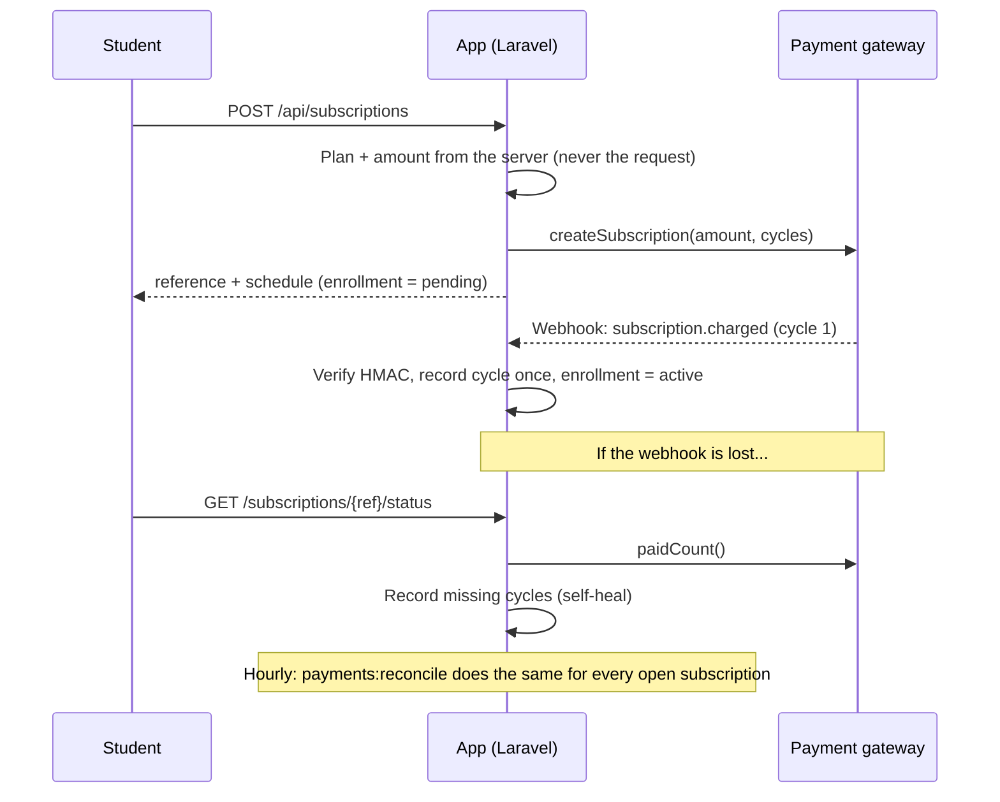
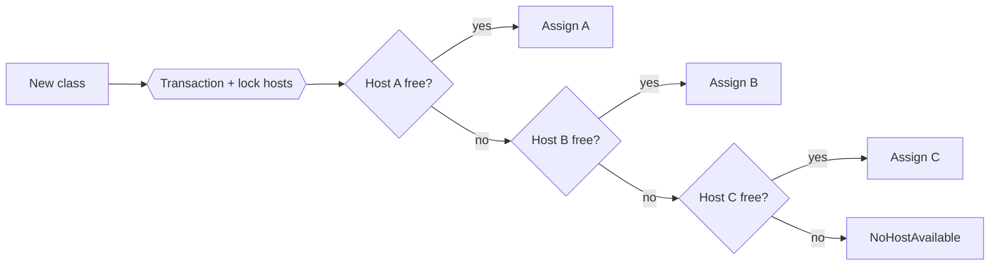

# Architecture

## Payment flow

## Why three layers

1. **Webhook** is the fast, normal path.
2. **Status self-heal** covers the user who is watching the page.
3. **Hourly reconcile** covers later cycles with nobody watching.

All three end in `SubscriptionFinalizer::applyCharge`, which records a cycle at most once.

## Host pool

Overlap rule: `existing.start < new.end AND existing.end > new.start`.
